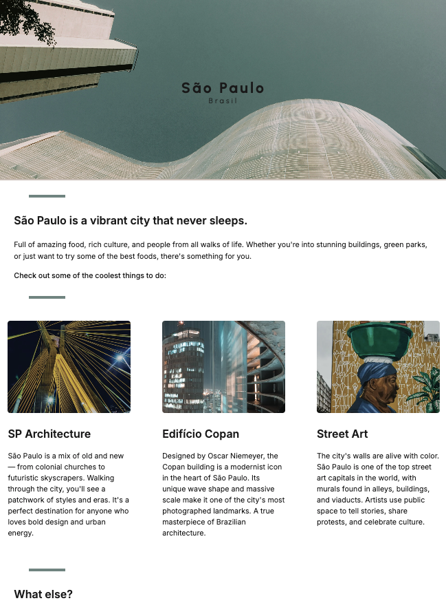

# Hometown Homepage

A simple responsive homepage built with HTML and CSS, showcasing the vibrant culture and attractions of São Paulo, Brazil.

## 📚 About the Project

This solo project was developed as part of the **Scrimba Frontend Career Path** – Web Basics & CSS module. It aims to demonstrate fundamental skills in HTML structure, semantic elements, CSS styling, and responsive layout for **desktop and tablet viewports**.

> ⚠️ This version is **not optimized for mobile screens**. The current design focuses on medium to large screen sizes (768px and up).

The homepage highlights key cultural aspects of São Paulo, including its architecture, street art, and iconic landmarks, while also providing useful guidance for visitors.

## 🛠️ Built With

- HTML5
- CSS3
- Google Fonts: Urbanist & Inter

## 🔍 Features

- Responsive layout (desktop-first)
- Optimized for medium and large screens
- Hover effects on images
- Consistent visual hierarchy
- Accessible text and alt descriptions for images
- External link to official tourism site

## 📸 Preview

 <!-- Replace with your actual screenshot path -->

📄 License
This project is for educational purposes only and is not intended for commercial use.

